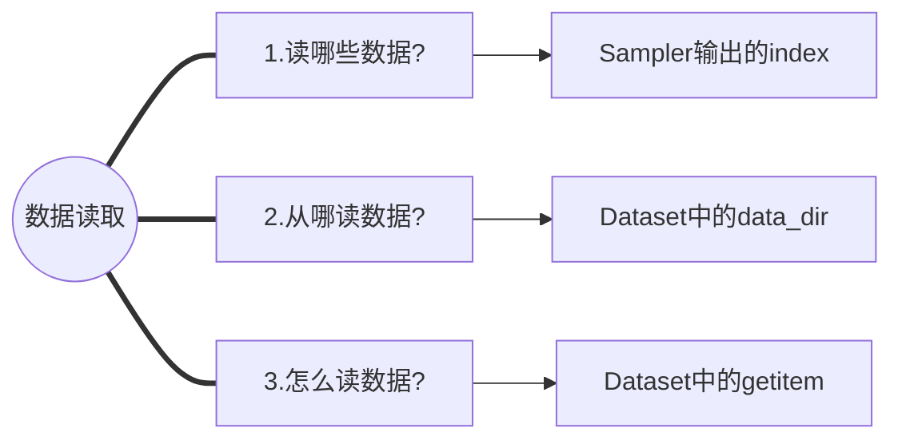
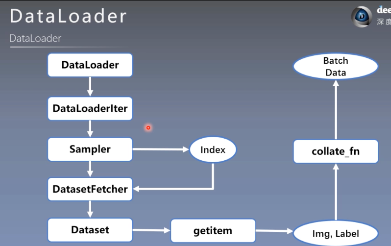

# 问题
## Q1: 共享内存为什么id函数地址不相同
```
arr = np.ones((3, 3))
t = torch.from_numpy(arr)
print("修改前numpy array:", arr)
print("修改前tensor:",t)
t[0,0] = 0
print("修改后numpy array:", arr)
print("修改后tensor:",t)
print(id(t), id(arr), id(t) == id(arr))

print('numpy 和torch互相转换2')
a = np.array([1, 2, 3], dtype=np.float32)
b = torch.Tensor(a)
b[0] = 999
print('共享内存' if a[0] == b[0] else '不共享内存')
print(id(a),id(b),id(a)==id(b))
```
**运行上面代码发现尽管共享内存为什么id函数显示出来的地址不相同：**

因为id(a)指的是指针，尽管指针指向的地址相同但指针不相同；

因此判断是否共享内存方式：
* `a[0] == b[0]`
* 将数组内存进行哈希比较两个哈希值是否相同
* 修改一个元素数值，另一个也会发生改变

# 笔记
## 模型训练5个步骤
* 生成数据
* 选择模型
* 选择损失函数
* 选择优化器
* 模型训练

## 数据模块 
* 数据收集
* 数据划分
* 数据读取
* 数据预处理

### 数据读取 DataLoader





