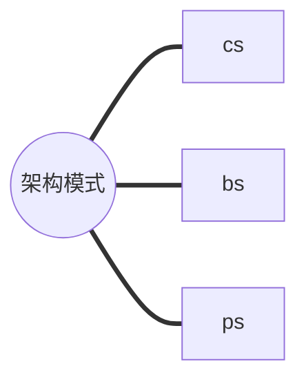
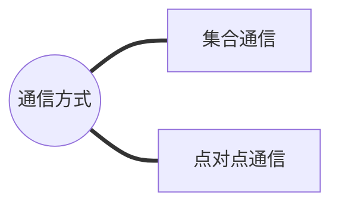

# 分布式机器学习笔记

1. GPU之间用NVLink进行连接，GPU和CPU之间用PCIe进行连接

2. 大规模分布式训练中主要使用参数服务器架构模式 （PS），参数服务器分布在多个GPU是
PS 模式的一种特殊形态；  
PS架构下通过集合通信来实现环同步，从而同步分布在多个 GPU 中的参数，Ring All
Reduce 是环同步的经典同步方式；

3. 通信方式（硬件篇）  

**机器内通信**
* 共享内存：CPU和CPU之间，多核处理器，手机用的比较多。通过总线进行。
* PCIe: GPU和CPU之间通信
* NVLink（直连模式）： GPU之间

**机器间通信**  
通过网络进行通信
* TCP/IP网络
* RDMA网络（直连模式）

4. 通信协调（软件篇）
* MPI
* NCCL/HCCL
* Gloo

5. 通信原语
* 集合通信方式
  * 一对多：Scatter / Broadcast（广播）
  * 多对一：Gather / Reduce（规约）
  * 多对多：All-Reduce / All-Gather / Ruduce Scatter / All to All 
多对多由一对多和多对一进行组合而来，例如All-Reduce = Reduce Scatter + All-Gather

6. 并行处理  

**硬件层面-硬件架构**
* 单指令流单数流（SISD）系统
* 单指令流多数据流（SIMD）系统：扩展SIMT系统，代表GPU
* 多指令流单数据流（MISD）系统：理论模型，未投入实践
* 多指令流多数据流（MIMD）系统：共享内存MIMD和分布式内存MIMD

**软件层面-分布式训练系统**  
组成：分布式用户接口、执行单节点训练和通信协调  
实现方式：框架内嵌分布式训练系统和跨框架通用分布式训练系统

7. 计算速率  
* 深度学习训练耗时=训练数据规模 * 单步计算量 / 计算速率
* 计算速率 = 单设备计算速率 *设备数 * 多设备并行效率（加速比）
* 加速比 = 系统实际达到吞吐量T_n / n个设备系统吞吐量nT(单设备吞吐量T)

8. 分布式训练挑战
* 内存墙：静态内存和动态内存组成，动态内存决定内存墙
* 性能墙：提高计算资源的利用率，搜索切分子图策略和通信策略，可以减少通讯时间或者复用通信与计算之间的GAP，从而提升芯片的使用率/利用率,进而提升性能
* 通讯墙：提高通讯比，尽可能把通信时延隐藏到计算里面
* 调优墙
