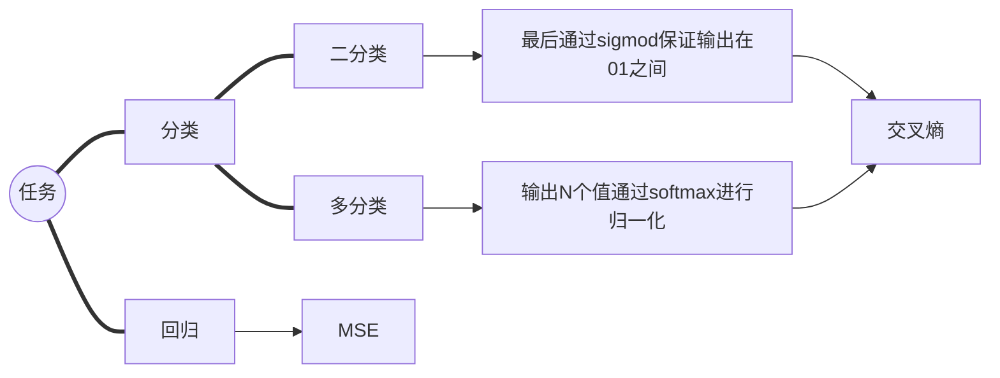

# 大语言模型学习笔记
## 损失函数的选择
模型任务和常见对应的损失函数：

```mermaid
flowchart LR;
	test((任务))
	test===分类
	分类===二分类-->最后通过sigmod保证输出在01之间-->交叉熵
	分类===多分类-->输出N个值通过softmax进行归一化-->交叉熵
	test===回归-->MSE
```

**Q1：多分类为什么采用softmax进行归一化**\
[参考答案](https://www.zhihu.com/question/40403377)

## 